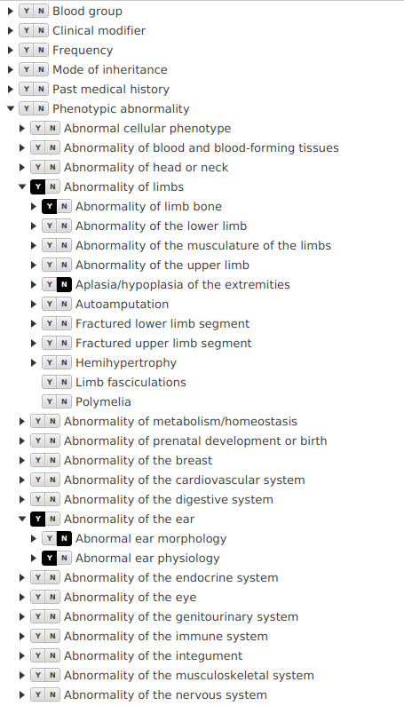
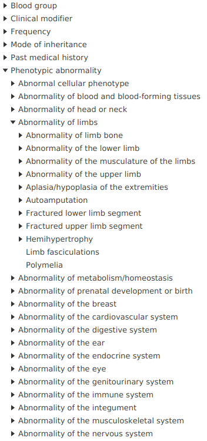

# phenofx
Forms and components for Monarch JavaFX tools.

The project is currently in preliminary phase.

## Components
The library offers the following components.

### Selectable ontology tree

The *selectable ontology tree* presents the ontology hierarchy as a tree, where each tree node has a segmented button 
to indicate presence (`Y`) or absence (`N`) of the corresponding phenotype feature.

### Simple ontology tree

The *simple ontology tree* presents the ontology hierarchy, allowing to browse neighborhood of a phenotype feature.

