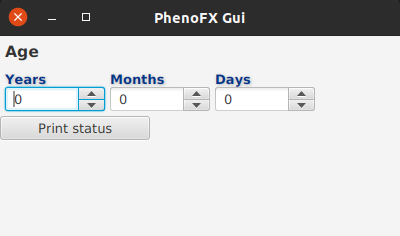

# phenofx
Forms and components for Monarch JavaFX tools.

The project is currently in preliminary phase.

## Components
The library offers the following components.


### Selectable ontology tree

The *selectable ontology tree* presents the ontology hierarchy as a tree, where each tree node has a segmented button 
to indicate presence (`Y`) or absence (`N`) of the corresponding phenotype feature.


### Simple ontology tree

The *simple ontology tree* presents the ontology hierarchy, allowing to browse neighborhood of a phenotype feature.


## Example JavaFX component library for using with desktop & web FX apps

The `phenofx-commons` contains a simple `AgeControl` a component that consists of 3 spinners to record age of the patient.
The `phenofx-commons` is used in `phenofx-gui`, a minimal desktop app.

### How to use

Assuming that JDK17 is on path, run the following to package and start *PhenoFX*:

```bash
cd phenofx
./mvnw clean package
 java --module-path phenofx-gui/target/phenofx-gui-0.0.1-SNAPSHOT.jar:phenofx-gui/target/lib -m phenofx.gui/org.monarchinitiative.phenofx.gui.PhenofxGui
```

If the command above runs OK, you should see a bunch of logging statements and the following window:


